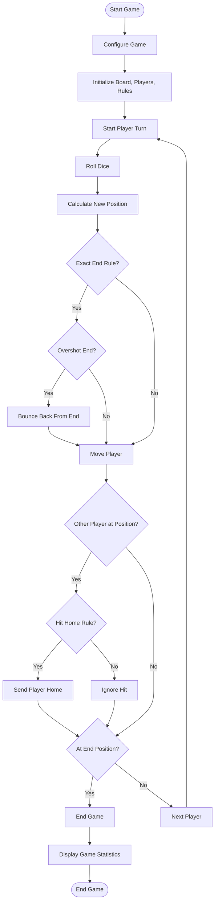

# Simple Frustration Board Game

Simple Frustration is a board game simulation implemented in Java, where players take turns rolling dice and moving around a board to reach their end position.

## Game Rules

### Basic Game
- Players start at their home positions and attempt to reach the end position first.
- Players roll dice on their turn and move clockwise around the board.
- When a player reaches the position just before their home, they divert up a "tail" towards the end position.
- The first player to reach their end position wins.

## Variations Implemented

This implementation includes all the required variations:

### 1. Player must land exactly on the END position to win
If a player's dice roll would take them beyond the END position, they "bounce back" from the end, moving backwards by the excess distance. This creates a more challenging endgame where players must roll the exact number needed to win.

### 2. Player will be sent HOME when HIT
When a player lands on a position occupied by another player, the player who was there first is sent back to their home position. This creates more strategic gameplay with opportunities to set back opponents.

### 3. Single Die
Players can choose to play with a single 6-sided die instead of two dice. This creates a more controlled game with smaller movements.

### 4. Large Board
The game supports both the standard board (18 main positions, 3 tail positions) and a larger board (36 main positions, 6 tail positions). The larger board creates a longer game with more strategic possibilities.

## Advanced Features

### Four Players
The game supports both 2-player games (Red and Blue) and 4-player games (Red, Blue, Green, and Yellow). Home positions are adjusted based on the board size:
- Basic board: Positions 1, 5, 10, and 14
- Large board: Positions 1, 10, 19, and 28

### Undo
Players can undo their last move, allowing them to take back a dice roll and try again. The undo feature properly restores the game state, including handling the reversal of "hit" events.

## Key Classes and Their Responsibilities

### Board Package
- **IBoard**: Interface defining the board functionality
- **BasicBoard**: Implementation of a basic 18-position board 
- **LargeBoard**: Implementation of a large 36-position board

### Dice Package
- **Dice**: Interface for dice behavior
- **SingleDie**: Implementation of a single 6-sided die
- **TwoDice**: Implementation of two 6-sided dice

### Players Package
- **Player**: Represents a player with position and movement
- **PlayerManager**: Manages all players and turn order

### Rules Package
- **RuleStrategy**: Interface for game rules behavior
- **BasicRule**: Default rules implementation
- **ExactEndRule**: Decorator adding exact-end requirements
- **HitHomeRule**: Decorator adding hit-home behavior

### Observers Package
- **GameObserver**: Interface for observing game events
- **ConsoleObserver**: Outputs game events to the console

### Game Package
- **Game**: Main game logic and flow controller
- **GameConfig**: Stores game configuration settings

### Undo Package
- **GameStateMemento**: Stores a snapshot of game state
- **GameHistory**: Manages the history of game states

### Factories Package
- **BoardFactory**: Creates appropriate board instances
- **DiceFactory**: Creates appropriate dice instances
- **PlayerFactory**: Creates player instances with correct positions

## Design Patterns Used

### Factory Pattern
Used in BoardFactory, DiceFactory, and PlayerFactory to create instances based on configuration parameters. This encapsulates object creation logic, allowing for easy modification of implementation details.

### Strategy Pattern
Used for the game rules through the RuleStrategy interface. Different rule implementations can be swapped at runtime without affecting the core game logic.

### Decorator Pattern
Used in the rules package to layer rule behavior. ExactEndRule and HitHomeRule both decorate a base rule, adding their behavior while preserving the original functionality.

### Observer Pattern
Used to notify interested parties about game events like moves, hits, and wins. The ConsoleObserver prints these events to the console.

### Memento Pattern
Used in the undo functionality to capture and restore game state without violating encapsulation. GameStateMemento stores the state and GameHistory manages these states.

## Program Flow

1. User starts the game and selects configuration options
2. The game initializes with appropriate board, players, dice, and rules
3. Players take turns:
   - Roll dice
   - Calculate new position based on rules
   - Check for hits and handle according to rules
   - Check for win condition
   - Switch to next player
4. When a player reaches the end position (subject to rules), they win
5. Final statistics are displayed

## Flowchart

## Implementation Details

### Game Abstraction
The game is designed with a clear separation of concerns, allowing each component to focus on a specific responsibility:
- The Board knows about positions and movement rules
- The Players know about their state and positions
- The Rules determine movement and hit behavior
- The Game coordinates all these elements

### Extensibility
The code is designed to be easily extensible:
- New board types can be added by implementing IBoard
- New dice types can be added by implementing Dice
- New rule variations can be added as decorators around existing rules
- New observers can be added to provide different outputs

### Console Output
The game provides detailed console output for each turn, showing:
- The current player and dice roll
- Player movements from old to new positions
- Hit events and their consequences
- Win announcements and game statistics

## Conclusion

This implementation of Simple Frustration demonstrates object-oriented design principles, design patterns, and clean code practices. It provides a flexible and extensible framework that could easily be adapted for other board games or additional variations.
